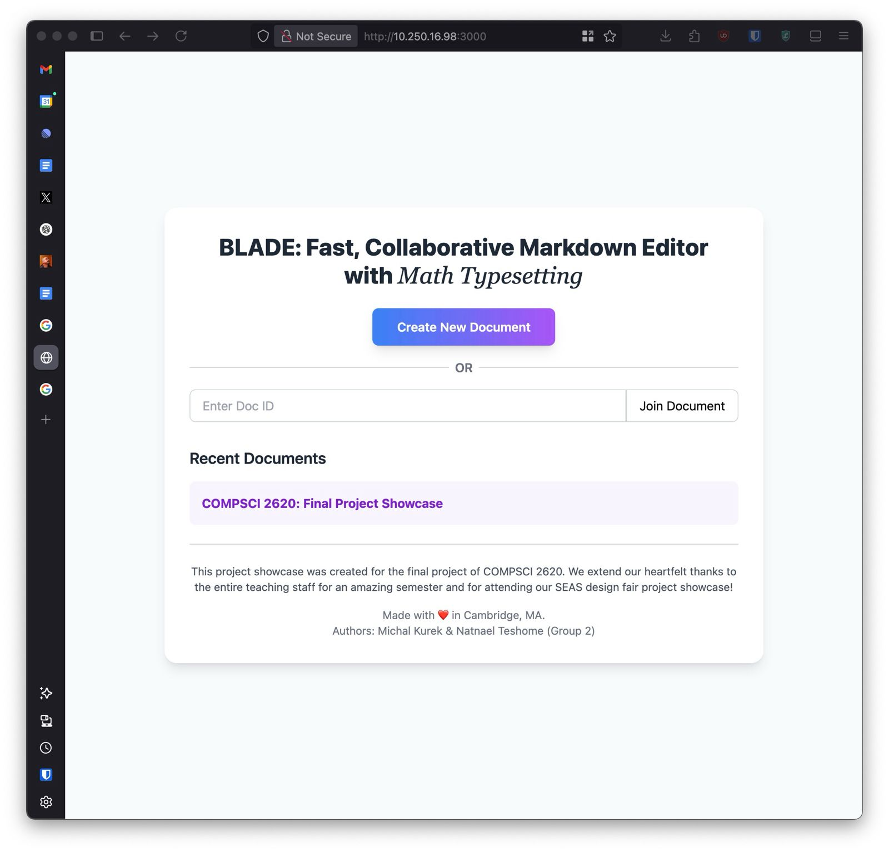
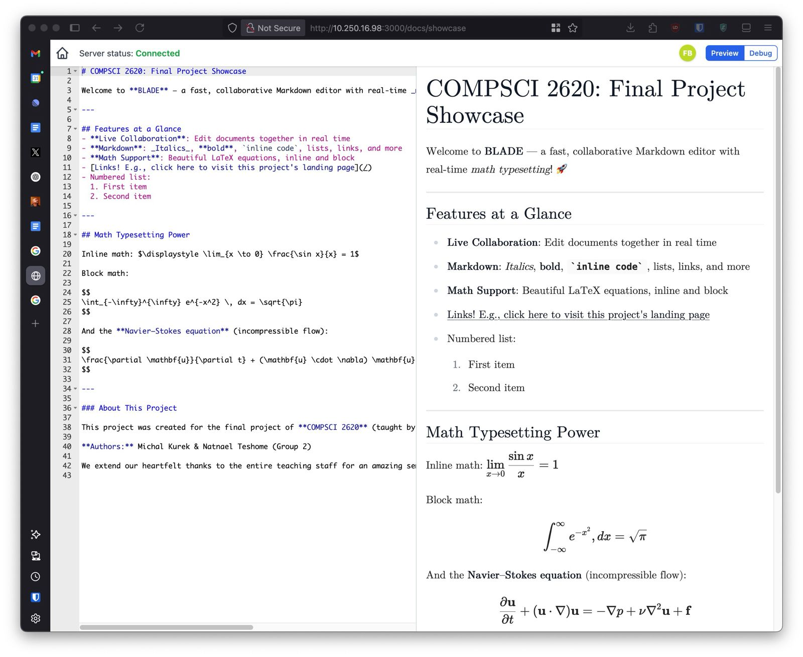

# BLADE: Fast, Collaborative Markdown Editor with Math Typesetting (OT Prototype)

**Live Demo: [Click Here!](https://www.michalkurek.com)**

This project implements a basic real-time collaborative Markdown editor using Operational Transformation (OT). It features a client-server architecture where text changes are synchronized between multiple users via WebSockets. A central server maintains the authoritative document state and manages operation history. The editor also supports LaTeX-style math typesetting within the Markdown preview.





## Features

*   **Operational Transformation:** Core OT logic (`apply`, `invert`, `compose`, `transform`) for text manipulation, ensuring eventual consistency.
*   **Client-Server Architecture:** Uses Socket.IO for WebSocket communication.
*   **Multi-Document Support:** Create and join separate collaborative document sessions.
*   **Revision Tracking:** Server maintains a linear history of operations for each document.
*   **Automatic Synchronization:** Clients automatically push changes and integrate incoming updates in near real-time using the OT algorithm. Manual pull/push options are also present for debugging or manual control.
*   **Basic Editor UI:** Uses Ace Editor for text input and Alpine.js for simple UI state management.
*   **Markdown Preview with Math:** Renders Markdown with support for LaTeX-style math via KaTeX and Marked.js.
*   **User Presence:** Shows connected users for a given document with unique colors and names.
*   **Persistence:** Document state and history are persisted using Redis.
*   **TypeScript:** Entire codebase (client and server) written in TypeScript.
*   **Testing:** Includes unit tests for the core OT logic using Vitest.

## Technology Stack

*   **Backend:** Bun, TypeScript, Fastify, Socket.IO, Redis
*   **Frontend:** TypeScript, Ace Editor, Alpine.js, Socket.IO Client, Marked.js, KaTeX
*   **Testing:** Vitest
*   **Build:** Bun, concurrently

## Project Structure

```
./
├── src/
│   ├── types.ts       # Shared TypeScript types for client/server messages and user info
│   ├── ot.ts          # Core Operational Transformation logic (TextOperation class)
│   ├── server.ts      # Fastify and Socket.IO server implementation, document management, persistence
│   └── ot.test.ts     # Unit tests for ot.ts
├── public/
│   ├── style.css      # Basic styling for the editor page
│   ├── index.html     # Main HTML structure for the editor
│   ├── dashboard.html # HTML structure for the document dashboard
│   └── client.ts      # Client-side TypeScript logic (Ace integration, OT state machine, Socket.IO handling)
├── package.json     # Project dependencies and scripts
├── tsconfig.json    # TypeScript configuration
└── README.md        # This file
```

## Core Concepts

### Operational Transformation (`src/ot.ts`)

The foundation is the `TextOperation` class, which represents changes to a document. Operations consist of components:

*   `retain(n)`: Keep the next `n` characters.
*   `insert(str)`: Insert the string `str`.
*   `delete(n)`: Delete the next `n` characters.

Key methods include:

*   `apply(doc)`: Applies the operation to a document string.
*   `invert(doc)`: Computes the inverse operation.
*   `compose(otherOp)`: Combines two sequential operations into one.
*   `transform(op1, op2)`: Transforms two concurrent operations (`op1`, `op2`) against each other, producing `[op1', op2']` such that applying `op1` then `op2'` yields the same result as applying `op2` then `op1'`. This is crucial for ensuring eventual consistency.

### Client-Server Protocol (`src/types.ts`, `src/server.ts`, `public/client.ts`)

Communication relies on a defined set of messages:

*   **Client -> Server:**
    *   `ClientPushMsg`: Sends a client-generated operation (`op`) based on a known server `revision`.
    *   `ClientPullMsg`: Requests operations from the server since a specific `revision`.
*   **Server -> Client:**
    *   `ServerInitialStateMsg`: Sent on connection, providing the full document (`doc`) and current `revision`.
    *   `ServerAckMsg`: Acknowledges a successful `ClientPushMsg`, returning the new server `revision`.
    *   `ServerUpdateMsg`: Broadcasts an operation (`op`) applied on the server, tagged with its `revision`.
    *   `ServerHistoryMsg`: Sends a list of operations (`ops`) in response to a `ClientPullMsg`, along with the current document state.
    *   `ServerErrorMsg`: Indicates an error occurred on the server.
    *   `ServerYourIdentityMsg`: Sends the client their assigned user information.
    *   `ServerCurrentUsersMsg`: Sends a list of all users currently connected to the document.
    *   `ServerUserJoinedMsg`: Broadcasts when a new user joins the document.
    *   `ServerUserLeftMsg`: Broadcasts when a user leaves the document.

### Server State (`src/server.ts`)

The server manages state for each document:

*   `content`: The current authoritative version of the document string.
*   `revision`: The revision number corresponding to the current `content`.
*   `history`: An array storing the `TextOperation` objects that transform revision `i` to `i+1`.
*   **Persistence:** Uses Redis to store and retrieve document `content`, `revision`, and `history`.

When receiving a `ClientPushMsg`, the server transforms the client's operation against any concurrent operations in the document's `history` before applying it, incrementing the revision, adding the transformed operation to `history`, and broadcasting an `ServerUpdateMsg` to other clients.

### Client State (`public/client.ts`)

The client manages its state relative to the server:

*   `syncedDoc`: The document state corresponding to `serverRevision`. This is the last known state confirmed by the server.
*   `virtualDoc`: `syncedDoc` plus any local, unpushed changes (`bufferedOp`). This is the state displayed in the editor and used as the base for generating new local operations.
*   `serverRevision`: The latest revision known to the client (updated via ACK, Update, History).
*   `state`: Tracks the client's synchronization status (`initializing`, `synchronized`, `dirty`, `awaitingPush`, `awaitingPull`).
*   `outstandingOp`: An operation sent to the server, awaiting acknowledgment (`ServerAckMsg`).
*   `bufferedOp`: Local changes made since the last push/pull, composed into a single operation, not yet pushed.
*   `username`: The username assigned by the server.
*   `users`: A list of other users currently connected to the same document.

The client uses `transform` to integrate incoming `ServerUpdateMsg` operations with its local `outstandingOp` and `bufferedOp` to maintain consistency. Local edits are composed into `bufferedOp` and the `virtualDoc` is updated immediately to provide a responsive editing experience. In "Automatic" mode (default), the client periodically pushes `bufferedOp` if changes exist.

## Setup and Running

**Prerequisites:**

*   Bun installed (`curl -fsSL https://bun.sh/install | bash`)
*   Redis server installed and running (e.g. `brew install redis && brew services start redis`). Optionally set `REDIS_URL` (e.g. `export REDIS_URL="redis://localhost:6379"`).

**Installation:**

```bash
bun install
```

**Build Client:**

The client-side TypeScript needs to be bundled into JavaScript for the browser.

```bash
bun run build:client
```

**Running the Server:**

*   For development (with auto-reloading for server and client):
    ```bash
    bun run dev
    ```
*   For production start:
    ```bash
    bun start
    ```

The server will start, typically on `http://localhost:3000`.

**Accessing the Application:**

Open your web browser and navigate to `http://localhost:3000`. From the dashboard, you can create a new document or join an existing one by ID. Open multiple tabs or browsers to simulate collaboration.

## Testing

Run the unit tests for the OT logic:

```bash
bun test
```

The tests in `src/ot.test.ts` verify the core properties and invariants of the `TextOperation` class methods (`apply`, `invert`, `compose`, `transform`).

## How It Works (Automatic Mode)

1.  **Connect:** Client connects via WebSocket to a specific document ID. Server assigns a username, sends `ServerYourIdentityMsg`, `ServerCurrentUsersMsg`, and `ServerInitialStateMsg` with the document's current state and revision. Client loads the document into the editor, updates its state (`syncedDoc`, `virtualDoc`, `serverRevision`), sets state to `synchronized`, and enables the editor.
2.  **Local Edit:** User types in the editor. Ace editor's `change` event triggers `handleLocalDelta`, which converts the Ace delta into a `TextOperation`. This operation is composed (`compose`) with any existing `bufferedOp`. The `virtualDoc` is updated immediately by applying the new operation to it. State becomes `dirty` if it wasn't already `awaitingPush`.
3.  **Automatic Push:** A timer (`autoPushTask`) periodically checks if the client is connected, in Automatic mode, and has a non-empty `bufferedOp`. If so:
    *   The current `bufferedOp` is moved to `outstandingOp`.
    *   `bufferedOp` is cleared.
    *   State becomes `awaitingPush`.
    *   A `ClientPushMsg` containing `outstandingOp` and `serverRevision` (the revision the outstandingOp is based on) is sent to the server.
4.  **Server Receives Push:**
    *   Server validates the client's `revision` against its own. If invalid, sends `ServerErrorMsg`.
    *   Server retrieves operations from the document's `history` that occurred after the client's reported `revision`.
    *   Server transforms the incoming `clientOp` against these concurrent historical operations using `TextOperation.transform`. This yields `[transformedClientOp, ...transformedHistoricalOps]`. Only `transformedClientOp` is needed for application.
    *   The `transformedClientOp` is applied to the server's `documentState`.
    *   The document's `revision` is incremented.
    *   The `transformedClientOp` is added to the document's `history`.
    *   The updated document state is persisted to Redis.
    *   A `ServerAckMsg` is sent back to the originating client with the new server `revision`.
    *   A `ServerUpdateMsg` containing the `transformedClientOp` and its new `revision` is broadcast to *all other* clients in the document's room.
5.  **Client Receives ACK:**
    *   State transitions from `awaitingPush`.
    *   The client's `syncedDoc` is updated by applying the *original* `outstandingOp` (the one sent to the server).
    *   `outstandingOp` is cleared.
    *   `serverRevision` is updated to the value from the ACK message.
    *   If `bufferedOp` is null (no edits during the push interval), state becomes `synchronized`. If `bufferedOp` exists, state becomes `dirty`.
6.  **Other Client Receives Update:**
    *   Client receives `ServerUpdateMsg`.
    *   Client retrieves the incoming `serverOp`.
    *   If the client has an `outstandingOp` (waiting for its own push ACK), the incoming `serverOp` is transformed against it: `[serverOpPrime, outstandingOpPrime] = TextOperation.transform(serverOp, outstandingOp)`. `outstandingOp` is updated to `outstandingOpPrime`.
    *   The resulting operation (`serverOp` if no outstanding op, or `serverOpPrime`) is then transformed against the client's `bufferedOp` (if any): `[finalOpToApply, bufferedOpPrime] = TextOperation.transform(serverOpPrime/serverOp, bufferedOp)`. `bufferedOp` is updated to `bufferedOpPrime`.
    *   The `syncedDoc` is updated by applying the server operation *transformed only against the outstandingOp* (if any).
    *   The `finalOpToApply` is applied to the editor content. `setEditorValue` is used to perform this update programmatically while ignoring the resulting `change` event from Ace to prevent feedback loops.
    *   The `virtualDoc` is updated to match the new editor content.
    *   `serverRevision` is updated.
    *   State is re-evaluated (`synchronized`, `dirty`, or remains `awaitingPush`).
7.  **Pull (less frequent in auto mode, used for recovery):** If the client detects a significant out-of-sync condition (e.g., receiving an update with a non-sequential revision number), it triggers a pull.
    *   State becomes `awaitingPull`.
    *   A `ClientPullMsg` is sent with the current `serverRevision`. The auto-push timer is temporarily stopped.
8.  **Server Receives Pull:**
    *   Server validates the `revision`.
    *   Retrieves operations from the document's `history` since the client's `revision`.
    *   Sends a `ServerHistoryMsg` with the list of historical operations and the current full document state and revision.
9.  **Client Receives History:**
    *   Client iterates through the received historical operations.
    *   Each operation is transformed against `outstandingOp` and `bufferedOp` (similar to handling `ServerUpdateMsg`).
    *   The transformed operations are applied sequentially to the editor content and `syncedDoc`.
    *   `serverRevision` and `localRevision` are updated to the latest revision from the message.
    *   The editor content is explicitly set to the final state.
    *   State is re-evaluated based on `outstandingOp` and editor content vs `syncedDoc`. The auto-push timer is restarted if in Automatic mode.

## Limitations & Future Work

*   **Error Handling:** While basic error logging and some recovery (like forcing a pull on inconsistent state) are present, a production-ready system would require more robust error detection, retry mechanisms, and conflict resolution strategies.
*   **Scalability:** The current in-memory document state on the server and the linear history approach for transforms have limitations for very large documents or extremely high user concurrency. A more scalable solution might involve sharding documents, using a persistent OT log, or exploring different OT implementations optimized for performance.
*   **Real-time Cursors:** Showing where other users are typing requires tracking cursor positions and selections on the client and broadcasting these via separate messages, transforming them based on operations, and rendering them in the editor.
*   **Undo/Redo:** Implementing robust collaborative undo/redo is complex in OT, requiring tracking inverse operations and coordinating their application across clients.
*   **Rich Text/Other Data Types:** OT can be extended to handle other data types beyond plain text (e.g., formatting, embedded objects), but this significantly increases complexity.
*   **Access Control:** No authentication or authorization currently exists; any client can modify any document given its ID.
